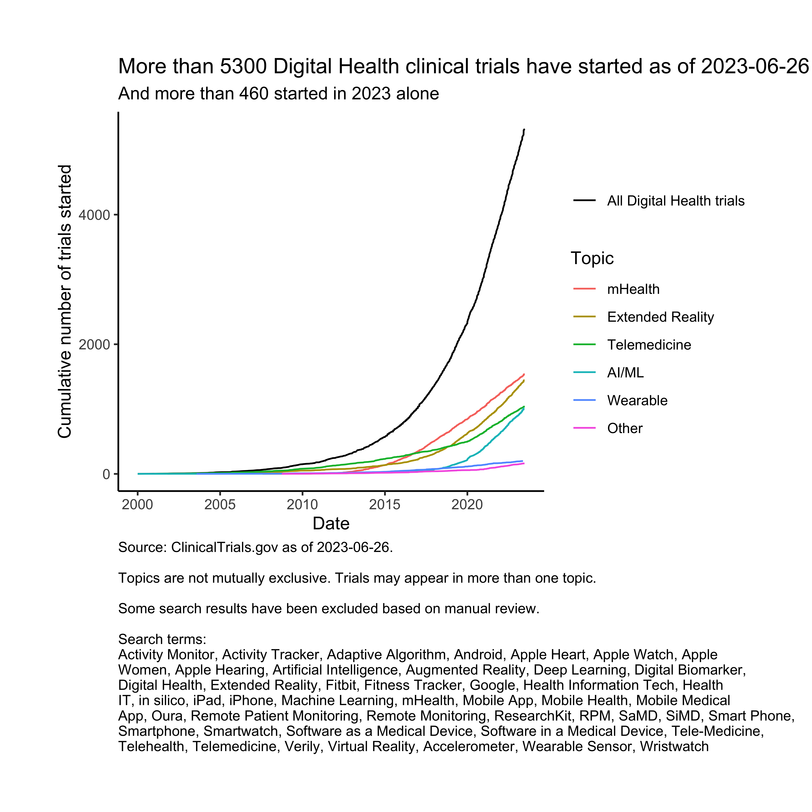

<!-- README.md is generated from README.Rmd. Please edit that file -->

# ctdl: Clinical Trials Downloader

<!-- badges: start -->

[](https://lifecycle.r-lib.org/articles/stages.html#experimental)
[](https://CRAN.R-project.org/package=ctdl)
<!-- badges: end -->

The goal of ctdl is to access [clinicaltrials.gov](clinicaltrials.gov)
data from R.

## Installation

You can install the development version of ctdl like so:

``` r
# install.packages("devtools")
devtools::install_github("bjoleary/ctdl")
```

## Example: Find and plot clinical trials associated with digital health topics

First, download the most recent clinical trials data:

``` r
library(ctdl)
library(fs)
download_directory <- fs::path_temp()
download_data(filepath_data = download_directory)
#> Checking for /var/folders/10/py32gfh16xjf_tx_6htqs6540000gn/T/Rtmpm1pX9N directory...
#> Renaming /var/folders/10/py32gfh16xjf_tx_6htqs6540000gn/T/Rtmpm1pX9N to /var/folders/10/py32gfh16xjf_tx_6htqs6540000gn/T/Rtmpm1pX9N_archive_20230304190459/...
#> Unzipping ...
#> [1] "2023-03-02"
```

Read in the study data:

``` r
studies <- read_studies(paste0(download_directory, "/"))
#> Warning: One or more parsing issues, call `problems()` on your data frame for details,
#> e.g.:
#>   dat <- vroom(...)
#>   problems(dat)
head(studies)
#> # A tibble: 6 × 69
#>   nct_id      nlm_downl…¹ study_fi…² results_…³ disposit…⁴ last_upd…⁵ study_fi…⁶
#>   <chr>       <chr>       <date>     <date>     <date>     <date>     <date>    
#> 1 NCT02867735 <NA>        2016-08-09 NA         NA         2022-04-08 2016-08-12
#> 2 NCT02801084 <NA>        2016-05-18 NA         NA         2022-04-09 2016-06-10
#> 3 NCT04318470 <NA>        2020-03-10 NA         NA         2022-03-31 2020-03-19
#> 4 NCT02790723 <NA>        2016-05-03 NA         NA         2022-04-14 2016-05-31
#> 5 NCT02683824 <NA>        2016-01-21 NA         NA         2022-04-08 2016-02-10
#> 6 NCT02602769 <NA>        2015-11-07 NA         NA         2022-04-08 2015-11-09
#> # … with 62 more variables: study_first_posted_date <date>,
#> #   study_first_posted_date_type <chr>, results_first_submitted_qc_date <date>,
#> #   results_first_posted_date <date>, results_first_posted_date_type <chr>,
#> #   disposition_first_submitted_qc_date <date>,
#> #   disposition_first_posted_date <date>,
#> #   disposition_first_posted_date_type <chr>,
#> #   last_update_submitted_qc_date <date>, last_update_posted_date <date>, …
```

Create some search terms and associate them with topics:

``` r
search_terms <- 
  tibble::tribble(
    ~term, ~topic,
    "Activity Monitor", "Wearable",
    "Activity Tracker", "Wearable",
    "Adaptive Algorithm", "AI/ML",
    "Android", "mHealth",
    "Apple Heart", "Wearable",
    "Apple Watch", "Wearable",
    "Apple Women", "mHealth",
    "Apple Hearing", "Wearable",
    "Artificial Intelligence", "AI/ML",
    "Augmented Reality", "Extended Reality",
    "Deep Learning", "AI/ML",
    "Digital Biomarker", "Digital Biomarker",
    "Digital Health", "Digital Health",
    "Extended Reality", "Extended Reality",
    "Fitbit", "Wearable",
    "Fitness Tracker", "Wearable",
    "Google", "Google",
    "Health Information Tech", "Health IT",
    "Health IT", "Health IT",
    "in silico", "in silico",
    "iPad", "mHealth",
    "iPhone", "mHealth",
    "Machine Learning", "AI/ML",
    "mHealth", "mHealth",
    "Mobile App", "mHealth",
    "Mobile Health", "mHealth",
    "Mobile Medical App", "mHealth",
    "Oura", "Wearable",
    "Remote Patient Monitoring", "Telemedicine",
    "Remote Monitoring", "Telemedicine",
    "ResearchKit", "mHealth",
    "RPM", "Telemedicine",
    "SaMD", "SaMD",
    "SiMD", "SiMD",
    "Smart Phone", "mHealth",
    "Smartphone", "mHealth",
    "Smartwatch", "Wearable",
    "Software as a Medical Device", "SaMD",
    "Software in a Medical Device", "SiMD",
    "Tele-Medicine", "Telemedicine",
    "Telehealth", "Telemedicine",
    "Telemedicine", "Telemedicine",
    "Verily", "Verily",
    "Virtual Reality", "Extended Reality",
    "Accelerometer", "Wearable",
    "Wearable Sensor", "Wearable",
    "Wristwatch", "Wearable"
  ) |>
    # Add the escaped (\) word boundary term "\\b" to the beginning and end
    # of each search term.
    dplyr::mutate(regex_term = paste0("\\b", .data$term, "\\b"))
```

We’ll also store some known false positives in a vector titled .

``` r
known_fp <- 
  c(
    "NCT03189251", "NCT04226612", "NCT00342394", "NCT00905346", "NCT00051363",
    "NCT01282814", "NCT04226612", "NCT00342394", "NCT00905346", "NCT00051363",
    "NCT01282814", "NCT00829452", "NCT00759954", "NCT00863915", "NCT00475605",
    "NCT00649467", "NCT00649805", "NCT00296127", "NCT01512459", "NCT00568152",
    "NCT00368719", "NCT01467570", "NCT01027117", "NCT01552252", "NCT01097226",
    "NCT01130051", "NCT01123395", "NCT02560077", "NCT02680119", "NCT01445964",
    "NCT02799433", "NCT01456507", "NCT03214276", "NCT01514019", "NCT01449786",
    "NCT01585519", "NCT01690676", "NCT01649492", "NCT01932112", "NCT02029781",
    "NCT01988389", "NCT02044419", "NCT02101112", "NCT02068014", "NCT02159313",
    "NCT02160158", "NCT02013856", "NCT02224365", "NCT02340039", "NCT02396615",
    "NCT02542033", "NCT02493140", "NCT02974491", "NCT03227874", "NCT02565472",
    "NCT03714464", "NCT04116580", "NCT03053986", "NCT02940249", "NCT03593135",
    "NCT02856893", "NCT03523403", "NCT03329638", "NCT03381664", "NCT03608319",
    "NCT03749031", "NCT03911050", "NCT03802682", "NCT03795324", "NCT03846986",
    "NCT04120259", "NCT04004182", "NCT04073719", "NCT01418625", "NCT00474682",
    "NCT00219388", "NCT00001330", "NCT00000335", "NCT01221116", "NCT00454974",
    "NCT01446965", "NCT01484938", "NCT01448005", "NCT01476722", "NCT01740999",
    "NCT01847105", "NCT02201706", "NCT03555123", "NCT03835390"
  )
```

Now we’ll filter the tibble based on the search terms:

``` r
dh_studies <- 
  find_studies(
    data_studies = studies,
    search_terms = search_terms,
    known_fp = known_fp,
    max_topics = 5L
  ) |> 
  # Remove any studies with a start date in the future
  dplyr::filter(.data$start_date <= lubridate::today())
```

And, finally, we’ll plot the results:

``` r
plot_studies(
  studies = dh_studies,
  description = "Digital Health",
  this_year = lubridate::year(lubridate::today()),
  search_terms = search_terms
) |> 
  plot()
```


